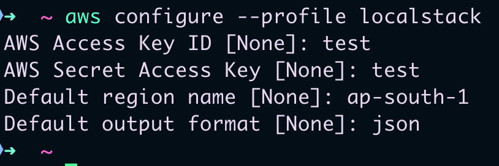

# mlops-basic-project
covers all ml-ops basics

## uv - modern python package manager
`uv python list' -> to see avialable python versions

`uv python pin 3.12` -> to pin current version. It will create .python-version file in current folder
uv init mlops-basic-project -> creates a folder with pyproject.toml, .gitignore etc

uv add pandas numpy -> creates a venv (if not exists) from .python-version file

## Docker

docker ps -> to run listing containers

docker logs -f localstack -> to see logs of container name

## AWS Cli

brew install awscli -> to download awscli

aws configure --profile localstack

aws s3 ls --endpoint-url=http://localhost:4566 --profile localstack 